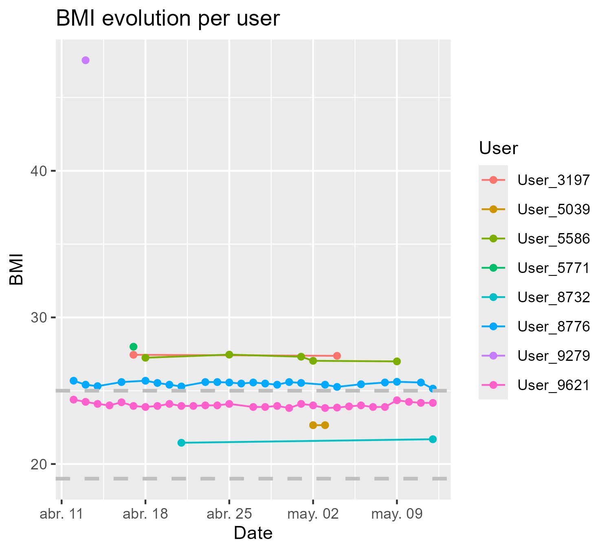
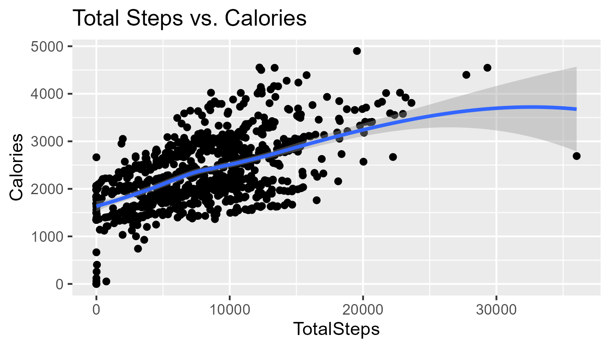
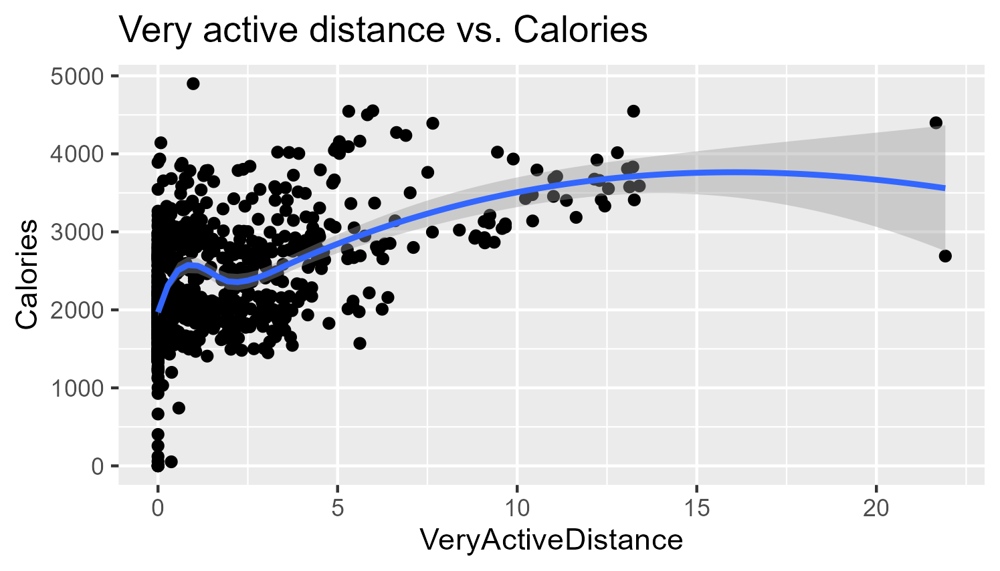

```{r setup, include=FALSE}
knitr::opts_chunk$set(echo = TRUE)
options(repos = c(CRAN = "https://cran.r-project.org"))
```

## Introduction

-   **What is Bellabeat?** Bellabeat is an innovative company that designs and produces wearable wellness devices that empower women to live healthier, more balanced lives. Their products, such as smart bracelets and watches, track various aspects of health, from sleep and physical activity to menstrual cycles.

-   **Research objective:** The primary objective of this analysis is to delve into Bellabeat's data to identify user behavior patterns, discover opportunities for product and service improvement, and provide strategic recommendations for the company. Specifically, we seek to answer the following questions:

    -   What are the most common usage patterns of Bellabeat devices?
    -   Are there distinct user segments with specific needs?
    -   What factors influence user motivation and engagement? How can we further personalize the user experience?

-   **Scope of the study:** This analysis is based on a dataset provided by Bellabeat, which includes information about users, their devices, and their recorded activities over a period of [indicate the period]. Key variables to be analyzed include:

    -   User demographics (age, gender, location)

    -   Device usage data (frequency of use, recorded health metrics)

    -   App interaction data (features used, synchronization frequency)

## Exploratory Data Analysis (EDA)

-   **Data cleaning:**

The data provided belongs to the competitor company FitBit, and is in the public domain. Similar .csv files are separated into 2 folders, one containing the data for March-April, and another for April-May. The tables were combined using rbind.rm during import.The import was done with the code import_and_combine.R file.

The libraries used in this project were: tidyverse, ggplot2, lubridate, dplyr, readr, janitor, data.table and tidyr.

The tables are separated into daily data, in hours and minutes. There is data on the activity of steps taken by the user and their intensity, calories burned, sleep time, weight and body mass. No duplicated values were found. The complete cleaning process can be found in file clean_data.R

The data is from 2016. If this were a real case, the analysis should be carried out with more recent data (close to 2024).

-   **Data analysis:**

    Tables contain data from 33 different users during 31 days. There is no information about gender or other data like body fat percentage.

    About existing data, only 8 users registered weight. From them, 2 people registered it regularly, 4 occasionally and 2 just once.



Data about sleeping habits also contains a small valid sample. There are 9 users with less of 10 records from a total of 31 days.


From daily data, there is a trend between steps, intensity and calories consumend per user. The more steps a user takes per day, the more calories they burn. However, there is a correlation between the intensity of the exercise and the energy consumed.





## In-Depth Analysis: Uncovering Behavioral Patterns

With available data, only a complete analysis about distances, intensities, calories and daily habits can be performed. But there is also important information about unavailable data.

We can assume that weight and sleeping time are provided by the user. Weight and body mass can be indicative of a person's overall health, but on their own they can lead to misunderstandings. Gender, age, body measurements, and so on are not taken into account. The amount of time a user spends sleeping, the regularity and quality of sleep are also good indicators of physical condition and quality of life.

Much of this important data is missing from the analysis. Its variation could be used to motivate the user to do more physical activity, or to have better sleeping habits (for example, avoiding screens just before bed).

It would be advisable for the device or app to remind the user to enter body data, or to equip the user with a smart scale that does the work for them. In terms of sleep quality, there are devices that automatically record when the user is asleep or not, based on heart rate and movement. This way, the user could go about their daily life without obsessing over the device. For this reason, reminders about body data should not be given too often, as the user may become bored, or worse, develop an obsession with their fitness.

The daily step graphs also show users who don't take a single step all day. If these are cases of physical inactivity, the device could set daily goals, perhaps rewards, that gamify the process and make the user find acquiring better habits more fun.

## Implications for Bellabeat: Conclusions

-   **Strategic recommendations:**

    -   Data collection automation. Less dependency on the user, more dependency on sensors.
    -   Possible other devices, like smart scales connected to the app.
    -   More collected data: gender, age, body measurements.
    -   Possibility of receiving reminders to record data.
    -   Automatic health status analysis. For example, heart rate during sleep.
    -   Gamification. Encourage the user to exercise. Set small daily challenges. The user may see positive changes in their data with sustained exercise.
